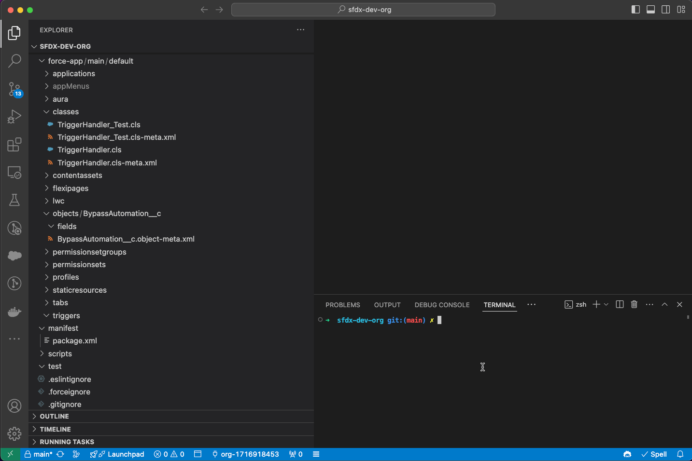

# kc-sf-plugin

[](https://www.npmjs.com/package/kc-sf-plugin) [](https://npmjs.org/package/kc-sf-plugin) [](https://github.com/k-capehart/kc-sf-plugin/blob/main/LICENSE)

This plugin is bundled with the [Salesforce CLI](https://developer.salesforce.com/tools/sfdxcli). For more information on the CLI, read the [getting started guide](https://developer.salesforce.com/docs/atlas.en-us.sfdx_setup.meta/sfdx_setup/sfdx_setup_intro.htm).

## Install

```bash
sf plugins install kc-sf-plugin@x.y.z
```

## Trigger-Framework

The trigger-framework command covers auto generating triggers, handlers, and other components used in relation to Apex Triggers.

First, use the `--init` flag to initialize the framework for a given template. This generates files that should only be created once, like interfaces or custom setting objects.

After initializing, use the `--sobject` flag to generate Apex Triggers (and its handler classes) for a given object.



The `--template` flag is used to choose which template to generate the apex code from. The available templates are:

- 1 (default): https://github.com/k-capehart/kc-sf-plugin/tree/main/src/templates/template-1
  - An extendable Apex Trigger Handler virtual class: https://github.com/k-capehart/sfdc-trigger-framework
  - A Custom Setting called BypassAutomation\_\_c
  - A checkbox field on BypassAutomation for the given Salesforce object
  - An Apex trigger that calls a handler class
  - An Apex handler class that extends the virtual class and uses the BypassAutomation\_\_c object to determine if logic should be skipped
  - An Apex helper class
  - An Apex test class for the helper class

If you want to create a custom template, then use the `--custom-template` flag. The value given to the flag should be the path to a directory containing templates for classes, triggers, objects, and/or fields. The directory should contain a `init.json` and `sobject.json` that provide instructions on which files to use, what their final name should be, and what type of file they are. `init.json` is used with the `--init` flag. `sobject.json` is used with the `--sobject` flag.

For example, imagine the following JSON file is stored at the relative path of `templates/sobject.json`. It is assumed that within this directory are also 5 other files called `BypassCustomField.txt`, `SObjectTrigger.txt`, `SObjectTriggerHandler.txt`, `SObjectTriggerHelper.txt`, and `SObjectTriggerHelper_Test.txt`. The `{{sobject}}` token is replaced with the value given in the `--sobject` flag.

```json
{
  "BypassCustomField.txt": {
    "type": "field",
    "name": "{{sobject}}__c",
    "object": "BypassAutomation__c"
  },
  "SObjectTrigger.txt": {
    "type": "trigger",
    "name": "{{sobject}}Trigger"
  },
  "SObjectTriggerHandler.txt": {
    "type": "class",
    "name": "{{sobject}}TriggerHandler"
  },
  "SObjectTriggerHelper.txt": {
    "type": "class",
    "name": "{{sobject}}Helper"
  },
  "SObjectTriggerHelper_Test.txt": {
    "type": "class",
    "name": "{{sobject}}Helper_Test"
  }
}
```

Running the command: `sf kc trigger-framework --custom-template templates/ --sobject Account` will create 5 files:

- Account\_\_c.field-meta.xml
- AccountTrigger.trigger
- AccountTriggerHandler.cls
- AccountTriggerHelper.cls
- AccountTriggerHelper_Test.cls

For more template examples: https://github.com/k-capehart/kc-sf-plugin/tree/main/src/templates/

## Commands

<!-- commands -->
* [`sf kc diff`](#sf-kc-diff)
* [`sf kc trigger-framework`](#sf-kc-trigger-framework)

## `sf kc diff`

Preview a retrieval and deploy to see what will be retrieved from the org, the potential conflicts, and the ignored files.

```
USAGE
  $ sf kc diff -o <value> [--json] [--flags-dir <value>] [--concise]

FLAGS
  -o, --target-org=<value>  (required) Login username or alias for the target org.
      --concise             Omits files that are forceignored.

GLOBAL FLAGS
  --flags-dir=<value>  Import flag values from a directory.
  --json               Format output as json.

DESCRIPTION
  Preview a retrieval and deploy to see what will be retrieved from the org, the potential conflicts, and the ignored
  files.

  You must run this command from within a project that has source tracking.

  The command outputs a table that describes the difference between your local project and an org. It is equivalent to
  running both the "sf project retrieve preview" and "sf project deploy preview" commands.

EXAMPLES
  View differences between local org and an org with the alias "my-org"
  $ sf kc diff --target-org my-org
  View differences between local org and the default org, omitting ignored files
  $ sf kc diff --concise

FLAG DESCRIPTIONS
  -o, --target-org=<value>  Login username or alias for the target org.

    Overrides your default org.

  --concise  Omits files that are forceignored.

    Ignore files by placing them in your .forceignore and using this flag.
```

_See code: [src/commands/kc/diff.ts](https://github.com/k-capehart/kc-sf-plugin/blob/1.4.7/src/commands/kc/diff.ts)_

## `sf kc trigger-framework`

Generate apex trigger frameworks based on templates.

```
USAGE
  $ sf kc trigger-framework [--json] [--flags-dir <value>] [-d <value>] [-i] [-s <value>...] [-t 1] [--custom-template
    <value>]

FLAGS
  -d, --target-dir=<value>       [default: force-app/main/default] The target directory for your salesforce project.
  -i, --init                     Initialize the trigger framework for the given template.
  -s, --sobject=<value>...       The name of the SObject that the trigger and classes will be created for.
  -t, --template=<option>        The template that should be used to generate the trigger framework.
                                 <options: 1>
      --custom-template=<value>  The directory in which the custom templates are located. View docs for more information
                                 on creating templates: https://github.com/k-capehart/kc-sf-plugin

GLOBAL FLAGS
  --flags-dir=<value>  Import flag values from a directory.
  --json               Format output as json.

DESCRIPTION
  Generate apex trigger frameworks based on templates.

  Given an SObject, creates a Trigger and accompanying handler classes and components.

  Use the `--init` flag to initialize the framework, then the `--sobject` flag to create triggers based on the
  framework.

EXAMPLES
  Initialize a trigger framework using template-1.
  $ sf kc trigger-framework --template 1 --init
  Create a new trigger and related components for the Account and Contact object using template-1.
  $ sf kc trigger-framework --template 1 --sobject Account --sobject Contact
  Create a new trigger and related components with a custom template by providing the path to the locally stored templates.
  $ sf kc trigger-framework --custom-template templates/ --sobject Account
```

_See code: [src/commands/kc/trigger-framework.ts](https://github.com/k-capehart/kc-sf-plugin/blob/1.4.7/src/commands/kc/trigger-framework.ts)_
<!-- commandsstop -->

## Build

To build the plugin locally, make sure to have yarn installed and run the following commands:

```bash
# Clone the repository
git clone git@github.com:k-capehart/kc-sf-plugin

# Install the dependencies and compile
yarn && yarn build
```

To use your plugin, run using the local `./bin/dev` or `./bin/dev.cmd` file.

```bash
# Run using local run file.
./bin/dev kc diff
```

There should be no differences when running via the Salesforce CLI or using the local run file. However, it can be useful to link the plugin to do some additional testing or run your commands from anywhere on your machine.

```bash
# Link your plugin to the sf cli
sf plugins link .
# To verify
sf plugins
```
